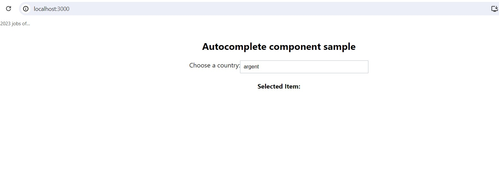

# deel-autocomplete-component

Once you pulled or downloaded the source code, In order to run the app:

- Install dependencies
> npm install
	
- Then run the app
> npm run start or npm start

-You should see the following UI:

